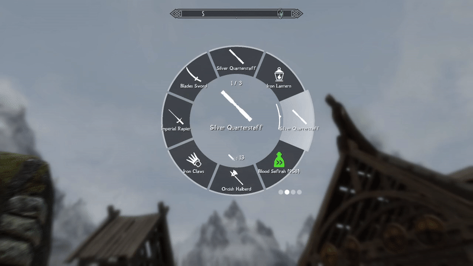

# Wheeler

Most, if not all modern RPG games have some sort of wheel menu for quick actions. GTA5's wheel allows the player to quickly browse their military arsenal, Witcher's wheel allows to switch between magic signs and consumables, and Bethesda's own title, Fallout4, has a wheel for favorited item access. This mod aims to integrate this modern UI paradigm into Skyrim, and hopefully making its players' life easier.

## The wheel

### Structure
Wheeler's hierarchy goes like this:

Wheels -> Wheel -> Slot -> Item

Simply put, you can have more than one wheels, in which you can have some slots, and each slot can contain more than one items. This hierarchy allows you to store basically your whole inventory/magic menu into the wheels.

*Browsing through multiple wheels*

*Switching between different items in a single slot*

### Display
Each slot displays the texture of the name of its current item(slots can have multiple items in it), and the center of the wheel displays an enlarged texture as well as a detailed description of the item, when applicable.

*Spinning the wheel*

### ImGui Library
Wheeler wouldn't be possible without the awesome [ImGui](https://github.com/ocornut/imgui) library serving as its frontend. I personally highly recommend it to any C++ developer looking to make something fun. This mod's ImGui algorithm is initially inspired by [this](https://github.com/ocornut/imgui/issues/434) post.

## Controls
### Toggling

Wheel menu can be toggled using a hotkey. You can:
  1. Short press the hotkey to toggle it on, until you press it again. 
  2. Press and hold the hotkey to keep it open, until you release.
  
The above 2 toggle methods coexists; if you press the hotkey long enough, it switches from mode 1 to mode 2. 

### Item usage

Using(equipping/consuming) an item through the wheel is no different from using it in inventory; simply left/right click on the item will equip it to the corresponding hand.

*Equipping items with ease*
### Wheel Editing

#### Edit Mode

Changes to the wheel can be made when you open the wheel in either inventory or magic menu. When you open the wheel in these two menus, the background will grey out, suggesting that you're now in "edit mode".

#### Creating New Wheel/Slot

By default, create an empty wheel using "N" key and an empty slot using "M" key. You can create as many wheels and as many slots in a single wheel as you'd like.

*Have as many slots as you'd like*

#### Item Insertion

To insert an item or magic into the a slot, hover on the item you desire in inventory, open the wheel, and left click(right shoulder) on the entry you wish to insert the item into.

*As convenient as favorite menu*

#### Slot/Wheel Ordering
To change a slot's order in a wheel, press up/down arrow to swap its position with neighboring slots.
To change a wheel's ordering among all wheels, press left/right arrow to swap its position with neighboring wheels.

*Visualize your edits in real-time*

#### Deletion

To delete an item from a slot, simply right click(left shoulder) on the item you wish to delete.  
Right clicking(left shoulder) on an empty slot deletes the slot.
Right clicking(left shoulder) on an empty wheel deletes the wheel(you can't delete the last wheel).

## Persistence

Your wheels' configuration persists on a per-save basis, meaning for each save you start with an empty wheel, and items in wheel for each save are independent from each other.

Thanks to iEquip's SKSE source, enchantable&poisonable&temperable items are differentiated by their enchantments/poisons/tempering through their unique IDs. This allows the wheel to tell the difference between 2 items of the same form with different enchants, an issue most of quick-equip mods(except iEquip) face.

Wheeler does not leave any script or reference in the player's save; item datas are safely stored in SKSE CO-save files with robust versioning, meaning it's safe for users to install&uninstall&update the plugin mid-save without worrying about save bloat or data corruption.

# To-dos  
Desired hierarchy: Wheeler -> Wheel -> WheelEntry -> WheelItem
- [ ] Input prompts
- [ ] L/R hand equipped indicator
- [x] Better input handling
  - [x] Only hook inputs that are bound, let other inputs go so user can walk while selecting wheel items
  - [x] Disable some other inputs too(e.g. opening inventory) even though they're not bound they still affects the wheel.
- [ ] Add other item types
  - [x] Power - they're the same as spell but stored in a different slot
  - [x] Shout - lmb -> equip; rmb -> release (same as power that are not equipped to hand)
  - [ ] Potion 
  - [ ] Arrow
- [ ] Enchanting support
  - [ ] Enchanted items have enchanting bar display
  - [ ] Smart enchant refill
  - [ ] Special icon / text color for enchanted items
  - [x] Enchanted item descriptions
- [ ] Misc
  - [ ] Controller rumble
  - [x] Custom font
  - [x] Asian language(Chinese, Japanese, Korean) with special characters
  - [x] Custom icons
  - [x] Optimize interpolator manager so that it only manages active interpolators, inactive interpolators are removed from its set, and they add themselves back when they receive a new interpolation target.

- Future plans
- [ ] Fallout-like side menu for consumable access
- [ ] 3D item display
- [ ] Non-trivial optimization
  - [ ] entry data caching
References:

https://gist.github.com/thennequin/64b4b996ec990c6ddc13a48c6a0ba68c
https://www.nexusmods.com/skyrimspecialedition/mods/82545?tab=posts
