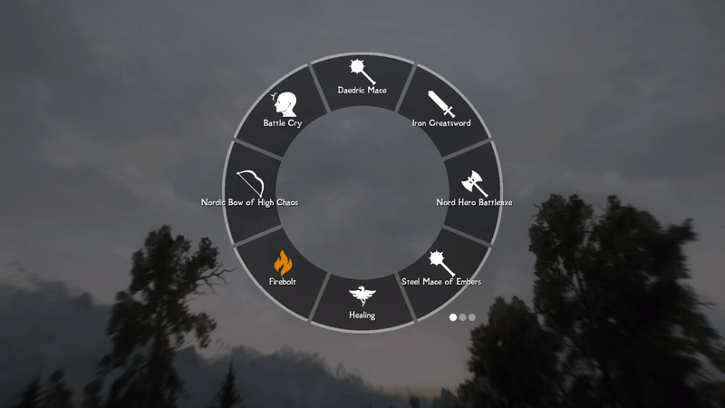

# Wheeler

Most, if not all modern RPG games have some sort of wheel menu for quick actions. GTA5's wheel allows the player to quickly browse their military arsenal, Witcher's wheel allows to switch between magic signs and consumables, and Bethesda's own title, Fallout4, has a wheel for favorited item access. This mod aims to integrate this modern UI paradigm into Skyrim, and hopefully making its players' life easier.

# The wheel

## Structure
Wheeler's hierarchy goes like this:

Wheels -> Wheel -> Slot -> Item

Simply put, you can have more than one wheels, in which you can have some slots, and each slot can contain more than one items. This hierarchy allows you to store basically your whole inventory/magic menu into the wheels.

*Browsing through multiple wheels*

*Switching between different items in a single slot*

## Display
Each slot displays the texture of the name of its current item(slots can have multiple items in it), and the center of the wheel displays an enlarged texture as well as a detailed description of the item, when applicable.

*Spinning the wheel*

# Controls
## Toggling
Wheel menu can be toggled using a hotkey. You can:
 - Short press the hotkey to toggle it on, until you press it again. 
 - Press and hold the hotkey to keep it open, until you release.
  
The above 2 toggle methods coexists; if you press the hotkey long enough, it switches from mode 1 to mode 2. 

## Item usage
Using(equipping/consuming) an item through the wheel is no different from using it in inventory; simply left/right click on the item will equip it to the corresponding hand.

*Equipping items with ease*
## Wheel Editing

### Edit Mode

Changes to the wheel can be made when you open the wheel in either inventory or magic menu. When you open the wheel in these two menus, the background will grey out, suggesting that you're now in "edit mode".

*Enter edit mode by opening the wheel in inventory/magic menu*
### Creating New Wheel/Slot

By default, create an empty wheel using "N" key and an empty slot using "M" key. You can create as many wheels and as many slots in a single wheel as you'd like.

*Have as many slots as you'd like*

### Item Insertion

To insert an item or magic into the a slot, hover on the item you desire in inventory, open the wheel, and left click(right shoulder) on the entry you wish to insert the item into.

*As convenient as favorite menu*

### Slot/Wheel Ordering
To change a slot's order in a wheel, press up/down arrow to swap its position with neighboring slots.
To change a wheel's ordering among all wheels, press left/right arrow to swap its position with neighboring wheels.

*Visualize your edits in real-time*

### Deletion

To delete an item from a slot, simply right click(left shoulder) on the item you wish to delete.  
Right clicking(left shoulder) on an empty slot deletes the slot.
Right clicking(left shoulder) on an empty wheel deletes the wheel(you can't delete the last wheel).

# Persistence

Your wheels' configuration persists on a per-save basis, meaning for each save you start with an empty wheel, and items in wheel for each save are independent from each other.

Thanks to iEquip's SKSE source, enchantable&poisonable&temperable items are differentiated by their enchantments/poisons/tempering through their unique IDs. This allows the wheel to tell the difference between 2 items of the same form with different enchants, an issue most of quick-equip mods(except iEquip) face.

Wheeler does not leave any script or reference in the player's save; item datas are safely stored in SKSE CO-save files with robust versioning, meaning it's safe for users to install&uninstall&update the plugin mid-save without worrying about save bloat or data corruption.

# dMenu Integration

Wheeler uses [dMenu](https://www.nexusmods.com/skyrimspecialedition/mods/97221) as its settings GUI. With dMenu, you can easily tweak various attributes, keybinds, and color of the wheel to your liking.

# FAQ
Q: I can't add a weapon/armor to the wheel
A: This is usually caused by an alternate start mod that adds random items into your inventory. This only happens to the set of starting items you have. To fix this issue, simply drop the item onto the ground and pick it again.

Q: Texture replacers?
A: You will be able to replace item icon textures and even add custom textures for items of dedicated formID&keyword. I will document this feature soon.

# Compatibility
I haven't noticed any incompatibilities between wheeler and any other UI mod, as wheeler goes through its own rendering pipeline. Please let me know if you find any, which I will try my best to fix.

# Source
[Github](https://github.com/D7ry/wheeler)
[Script I used to generate this page from markdown](https://github.com/D7ry/markdown-to-nexus-bb-code)

# Credits
[LamasTinyHUD](https://www.nexusmods.com/skyrimspecialedition/mods/82545) and the author mlthelama. Referring to its ImGui codebase significantly helped me understand how to draw .svg files and much more. I can't stress how much the author's source has helped me
[DearImGui](https://github.com/ocornut/imgui) for its awesomeness
[Ryan](https://www.nexusmods.com/skyrimspecialedition/users/5687342) for clib
[Original algorithms](https://github.com/ocornut/imgui/issues/434) that has inspired this mod in its early stage
[iEquip](https://www.nexusmods.com/skyrimspecialedition/mods/27008)'s SKSE source that has helped me understand how to differentiate items through unique ID indexing
[Sovngarde](https://www.nexusmods.com/skyrimspecialedition/mods/386)'s font is being used as wheeler's default English font
My patreons for your support!
Horizon: Forbidden West and GTA5 for artistic inspiration
绝伦 for the cover image

# Support
[Support me on Patreon](https://www.patreon.com/d7ry)